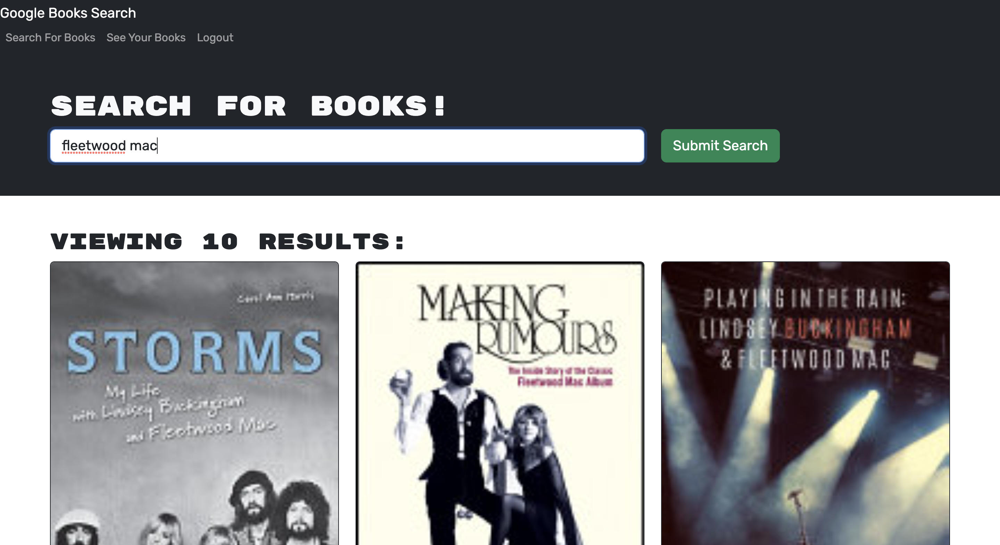

 
# Book-Search-Engine 

## Table of Contents 

- [Description](#description)
- [Technologies](#technologies)
- [Usage](#usage)
- [Screenshots](#screenshots)

## Description
 
A MERN stack application where users can signup, search books via the Google Books API, and save their favorites.      
Originally a working search engine built with a RESTful API, the app has been refactored to be a GraphQL API built with Apollo Server.      
It is deployed to Heroku with a MongoDB database using MongoDB Atlas.

## Technologies

- React
- MongoDB
- Node.js
- Express.js
- GraphQL
- Apollo Server
- JWT
- Bootstrap
- Heroku
- MongoDB Atlas

## Usage

To access the app visit the following url:             
[https://book-search-engine-nadel-4672eb49cc03.herokuapp.com/](https://book-search-engine-nadel-4672eb49cc03.herokuapp.com/)   
  

## Screenshots

